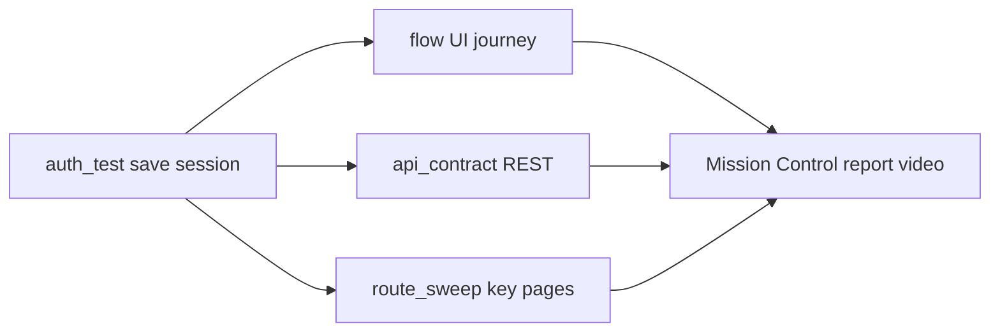

# Test a CRM with Argus

Golden-path packs for pointing Zyvor Argus at **your own** CRM sandbox.
Credentials stay in env vars — nothing here calls a Zyvor-owned CRM tenant.

## Shared recipe

1. **Auth once** — Mission Control → **API** → **Auth & session**, or CLI `argus api auth-test`, with the CRM login URL (or API token). Session lands at `reports/artifacts/auth/<host>.json`.
2. **UI golden path** — **Journeys** → **Flow test** (or `argus flow run`) with the pack’s `.steps` file and `--session`.
3. **API contract** — **API** → **API contract** (or `argus api test --workflow …`) against the CRM REST API with a bearer / private-app token.
4. **Regression surface** — **Visual** → **Route sweep** with the pack’s routes; schedule via Mission Control when you want a loop.

**Out of scope for these packs:** Lightning Experience shadow DOM (Sales Cloud pack uses **Classic UI + REST** instead), interactive OAuth/SAML browser dances, MFA/TOTP. Use password login or a pre-issued API token only.

## Packs

| Pack | UI base (typical) | API base (typical) | Assets |
|------|-------------------|--------------------|--------|
| [HubSpot](hubspot.md) | `https://app.hubspot.com` | `https://api.hubapi.com` | [`hubspot-demo.steps`](../assets/crm/hubspot-demo.steps), [`hubspot-contacts.workflow.json`](../assets/crm/hubspot-contacts.workflow.json), [`hubspot-routes.txt`](../assets/crm/hubspot-routes.txt) |
| [Pipedrive](pipedrive.md) | `https://app.pipedrive.com` | `https://api.pipedrive.com` | [`pipedrive-demo.steps`](../assets/crm/pipedrive-demo.steps), [`pipedrive-deals.workflow.json`](../assets/crm/pipedrive-deals.workflow.json), [`pipedrive-routes.txt`](../assets/crm/pipedrive-routes.txt) |
| [Zoho CRM](zoho.md) | `https://crm.zoho.com` | `https://www.zohoapis.com` | [`zoho-demo.steps`](../assets/crm/zoho-demo.steps), [`zoho-leads.workflow.json`](../assets/crm/zoho-leads.workflow.json), [`zoho-routes.txt`](../assets/crm/zoho-routes.txt) |
| [Salesforce Sales Cloud](salesforce.md) | `https://<my-domain>.my.salesforce.com` (Classic) | same instance URL + `/services/data/` | [`salesforce-demo.steps`](../assets/crm/salesforce-demo.steps), [`salesforce-accounts.workflow.json`](../assets/crm/salesforce-accounts.workflow.json), [`salesforce-routes.txt`](../assets/crm/salesforce-routes.txt) |

Markdown specs for `argus test generate` live under [`prompts/examples/`](../../prompts/examples/) as `crm-hubspot.md`, `crm-pipedrive.md`, `crm-zoho.md`, `crm-salesforce.md`.

## Coverage per pack (3–5 checks)

1. Login + session reuse
2. List view loads (contacts / deals / leads)
3. Open first record → detail visible
4. Optional create in **sandbox only** (API POST preferred)
5. Authenticated list API returns 200 + expected JSON shape

Selectors and paths drift by portal version — expect a one-time tweak per tenant theme.

## Related

- [Common workflows](../user/workflows.md)
- [Test zyvor.dev](../user/test-zyvor-dev.md) — same auth → flow pattern on a public site
- [Auth & session](../user/pages/api/dashboard-actions-auth.md)
- [Flow test](../user/pages/journeys/dashboard-actions-flow.md)
- [API contract](../user/pages/api/dashboard-actions-api-contract.md)
- [Route sweep](../user/pages/visual/dashboard-actions-route-sweep.md)
