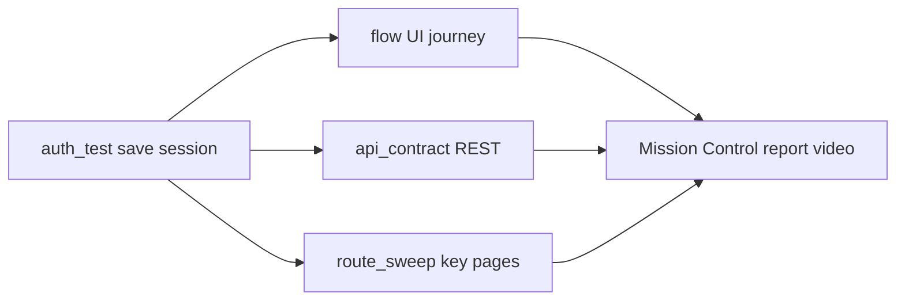

# Test a CRM with Argus

Golden-path packs for pointing Zyvor Argus at **your own** CRM sandbox.
Credentials stay in env vars — nothing here calls a Zyvor-owned CRM tenant.

## Shared recipe

1. **Auth once** — Mission Control → **API** → **Auth & session**, or CLI `argus api auth-test`, with the CRM **login form** (password; MFA off). Session lands at `reports/artifacts/auth/<host>.json`.
2. **UI golden path** — **Journeys** → **Flow test** (or `argus flow run`) with the pack’s `.steps` file and `--session`.
3. **Regression surface** — **Visual** → **Route sweep** with the pack’s routes; schedule via Mission Control when you want a loop.
4. **Optional API** — when you later have a bearer/private-app token, use the pack’s `.workflow.json` with `argus api test --workflow …`.

**Primary path for Zoho CRM and Salesforce Sales Cloud is UI-only** (username/password). API workflows in those packs are optional appendices.

**Out of scope:** Lightning Experience shadow DOM (Salesforce pack uses **Classic** + codegen for Lightning), interactive OAuth/SAML browser dances, MFA/TOTP.

## Packs

| Pack | UI base (typical) | API base (typical) | Assets |
|------|-------------------|--------------------|--------|
| [HubSpot](hubspot.md) | `https://app.hubspot.com` | `https://api.hubapi.com` | [`hubspot-demo.steps`](../assets/crm/hubspot-demo.steps), [`hubspot-contacts.workflow.json`](../assets/crm/hubspot-contacts.workflow.json), [`hubspot-routes.txt`](../assets/crm/hubspot-routes.txt) |
| [Pipedrive](pipedrive.md) | `https://app.pipedrive.com` | `https://api.pipedrive.com` | [`pipedrive-demo.steps`](../assets/crm/pipedrive-demo.steps), [`pipedrive-deals.workflow.json`](../assets/crm/pipedrive-deals.workflow.json), [`pipedrive-routes.txt`](../assets/crm/pipedrive-routes.txt) |
| [Zoho CRM](zoho.md) | `https://crm.zoho.com` (UI-first) | optional `zohoapis.*` | [`zoho-demo.steps`](../assets/crm/zoho-demo.steps), [`zoho-routes.txt`](../assets/crm/zoho-routes.txt); API optional |
| [Salesforce Sales Cloud](salesforce.md) | `https://<my-domain>.my.salesforce.com` (**Classic**, UI-first) | optional same host `/services/data/` | [`salesforce-demo.steps`](../assets/crm/salesforce-demo.steps), [`salesforce-routes.txt`](../assets/crm/salesforce-routes.txt); API optional |

Markdown specs for `argus test generate` live under [`prompts/examples/`](../../prompts/examples/) as `crm-hubspot.md`, `crm-pipedrive.md`, `crm-zoho.md`, `crm-salesforce.md`.

## Coverage per pack (3–5 checks)

1. Login + session reuse (form login; MFA off)
2. List view loads (contacts / deals / leads / accounts)
3. Open first record → detail visible
4. Route sweep on key tabs
5. Optional: authenticated list API when a token is available

Selectors and paths drift by portal version — expect a one-time tweak per tenant theme.

## Related

- [Tutorial 19 — Test a CRM (UI-first)](../tutorials/19-crm-golden-paths.md) — hands-on walkthrough
- [Common workflows](../user/workflows.md)
- [Test zyvor.dev](../user/test-zyvor-dev.md) — same auth → flow pattern on a public site
- [Auth & session](../user/pages/api/dashboard-actions-auth.md)
- [Flow test](../user/pages/journeys/dashboard-actions-flow.md)
- [API contract](../user/pages/api/dashboard-actions-api-contract.md)
- [Route sweep](../user/pages/visual/dashboard-actions-route-sweep.md)
