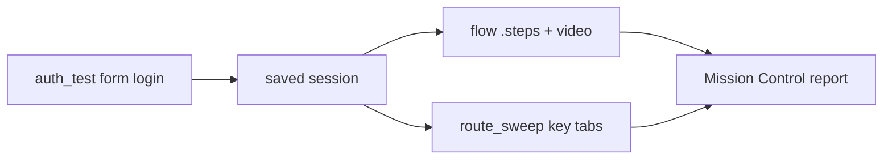

# Tutorial 19 — Test a CRM (UI-first golden paths)

Point Argus at **your own** CRM sandbox and run the same loop every pack uses: **password login → saved session → UI journey (video) → route sweep**. No Zyvor-owned CRM tenant; credentials stay in your env.

**Zoho CRM** and **Salesforce Sales Cloud** are **UI-first**: username + password only. API tokens are optional appendices when you have them later. HubSpot and Pipedrive still offer both UI and API in the primary recipe.

**Prerequisites:** [Tutorial 1](01-getting-started.md), [Tutorial 11](11-flow-tests.md) (flow + route sweep), [Tutorial 12](12-api-auth-realtime.md) (auth session). A CRM sandbox **you** control with **MFA off**.

Reference packs: [Test a CRM](../crm/README.md).

---

## What you get

| Pack | Primary path | Needs for happy path |
|------|--------------|----------------------|
| [HubSpot](../crm/hubspot.md) | UI + private-app API | User/pass + `pat-…` token |
| [Pipedrive](../crm/pipedrive.md) | UI + API token | User/pass + API token |
| [Zoho CRM](../crm/zoho.md) | **UI only** | User/pass, correct DC, ≥1 Lead |
| [Salesforce](../crm/salesforce.md) | **UI only (Classic)** | User/pass, My Domain, Classic, ≥1 Account |



---

## 0. Will this run? (checklist)

Before you spend time on selectors:

1. Sandbox / trial / Developer Edition user with **MFA off** (no OTP, no SSO for v1)
2. Correct host (Zoho data centre, Salesforce **My Domain**)
3. Salesforce: user switched to **Classic** (or Classic as default)
4. At least one list row to open (Lead / Account / Contact / Deal)
5. Expect one local tweak if portal labels differ (`click` / `assert` text)

---

## 1. Pick a pack and set env

```bash
# Example — Zoho (UI-first)
export ZOHO_DC=com   # eu, in, …
export ZYVOR_BASE_URL=https://crm.zoho.${ZOHO_DC}
export ZOHO_USER='you@example.com'
export ZOHO_PASS='…'

# Example — Salesforce Classic (UI-first)
export ZYVOR_BASE_URL=https://your-domain.my.salesforce.com
export SALESFORCE_USER='you@example.com'
export SALESFORCE_PASS='…'
```

HubSpot / Pipedrive env vars are in their pack pages. Assets live under [`docs/assets/crm/`](../assets/crm/).

---

## 2. Auth once (form login)

Auth-probe drives the password form and writes `reports/artifacts/auth/<host>.json`. Zoho’s email-first two-step (`#login_id` → Next → `#password`) and Salesforce `#username` / `#password` / `#Login` are handled automatically.

### Zoho

```bash
ACCOUNTS="https://accounts.zoho.${ZOHO_DC}/signin"
HOST="crm.zoho.${ZOHO_DC}"

argus api auth-test "$ZYVOR_BASE_URL" \
  --login-url "$ACCOUNTS" \
  --username "$ZOHO_USER" --password "$ZOHO_PASS" \
  --protected /crm/tab/Leads
```

### Salesforce Classic

Switch to Classic in a normal browser once, then:

```bash
argus api auth-test "$ZYVOR_BASE_URL" \
  --login-url / \
  --username "$SALESFORCE_USER" --password "$SALESFORCE_PASS" \
  --protected /001/o
```

**Mission Control:** **API** → **Auth & session** — same base URL, login URL, username/password, protected path. Confirm the session file name under `reports/artifacts/auth/` (use that basename for `--session`).

---

## 3. Run the UI golden path (video)

```bash
# Zoho — Leads list → open first lead
argus flow run "$ZYVOR_BASE_URL" \
  --steps docs/assets/crm/zoho-demo.steps \
  --session "$HOST" --video

# Salesforce Classic — Accounts → open first account
argus flow run "$ZYVOR_BASE_URL" \
  --steps docs/assets/crm/salesforce-demo.steps \
  --session your-domain.my.salesforce.com --video
```

You get per-step pass/fail and a `journey.webm` under `reports/artifacts/flows/`.

**Mission Control:** **Journeys** → **Flow test** — paste the pack’s `.steps`, attach the saved session, enable **record video**, Run.

If a `click` fails, open the CRM once, note the visible label on the first row, and edit that one line in the `.steps` file.

---

## 4. Route sweep (regression surface)

Paste the pack’s routes from `docs/assets/crm/*-routes.txt` into **Visual** → **Route sweep** (use the dashboard when login is required — CLI route-sweep has no `--session`).

| Pack | Typical paths |
|------|----------------|
| Zoho | `/crm/tab/Leads`, Contacts, Accounts, Deals (see `zoho-routes.txt`) |
| Salesforce Classic | `/home/home.jsp`, `/001/o`, `/003/o`, `/006/o`, `/00Q/o` |
| HubSpot / Pipedrive | See each pack’s `*-routes.txt` |

Schedule the same card from **Runs & schedules** if you want a loop after deploys.

---

## 5. Salesforce Lightning (codegen, not hand steps)

Committed [`salesforce-demo.steps`](../assets/crm/salesforce-demo.steps) targets **Classic** only. Lightning uses shadow DOM — do not expect those steps to pass there.

1. Log into Lightning in a normal browser.
2. Mission Control → **Import codegen** (or `node playwright/scripts/record-flow.mjs`) against `/lightning/o/Account/list`.
3. Save the generated steps; run with Flow test + the same auth session.

---

## 6. Optional: API when you have a token

Skip this until a bearer / private-app / OAuth access token exists. Packs keep `.workflow.json` files for that day:

```bash
# Zoho (optional)
argus api test "https://www.zohoapis.${ZOHO_DC}" \
  --workflow docs/assets/crm/zoho-leads.workflow.json \
  --token "$ZOHO_TOKEN"

# Salesforce (optional)
argus api test "$ZYVOR_BASE_URL" \
  --workflow docs/assets/crm/salesforce-accounts.workflow.json \
  --token "$SALESFORCE_TOKEN"
```

HubSpot / Pipedrive include API in the primary pack CLI — see those pages.

---

## 7. Spec → generate (optional)

Each pack has a markdown story under `prompts/examples/` (`crm-zoho.md`, `crm-salesforce.md`, …) for `argus test generate` if you want Playwright specs in addition to flow steps.

---

## Troubleshooting

| Symptom | Fix |
|---------|-----|
| Still on login after auth | MFA/SSO on? Wrong DC / My Domain? Check form-login detail in the auth report |
| `click "Lead Name"` / `"Account Name"` fails | Portal label differs — change the click text to the first row’s visible name |
| Salesforce flow blank / wrong chrome | Not in Classic — switch UI and re-auth |
| Session not found | `--session` must match `reports/artifacts/auth/<host>.json` basename |
| Empty list → open-record fails | Create one Lead / Account in the sandbox first |

---

## Related

- [Test a CRM — pack index](../crm/README.md)
- [Zoho pack](../crm/zoho.md) · [Salesforce pack](../crm/salesforce.md) · [HubSpot](../crm/hubspot.md) · [Pipedrive](../crm/pipedrive.md)
- [Tutorial 11 — Flow tests](11-flow-tests.md)
- [Tutorial 12 — Auth & API](12-api-auth-realtime.md)
- [Tutorial 13 — zyvor.dev recording](13-test-zyvor-dev-recording.md) — same auth → flow pattern on a public site
- [Common workflows](../user/workflows.md)
